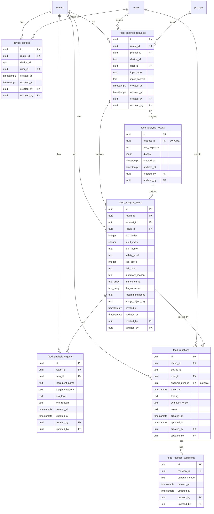

## Food Scanner System

 **数据库设计（Postgres）

目标：支持
- 输入分析内容，支持多文本和图片输入
- 分析列表，按安全/中等/高风险分组显示多条数据
- 分析详情，风险百分比 + 触发成分列表
- 反应记录，Track Your Reaction
- 统计概览，Your Personal Trigger

---

## 1. 核心数据模型总览

- `device_profiles`：设备与用户映射，目前使用设备唯一 ID 作为用户 ID，用于以后扩展为多用户场景
- `food_analysis_requests`：**分析会话**，代表用户发起的一次完整分析请求，包含设备标识、用户标识、关联的 Prompt 模板
- `food_analysis_results`：**分析结果**，存储 LLM 返回的原始 JSON 响应和解析后的菜品列表（JSONB 格式）
- `food_analysis_items`：将单次分析中的每一道菜拆成行，例如单次分析了三道菜，则分别存储，支持菜单列表与汇总
- `food_analysis_triggers`：每道菜对应的触发成分（Heavy Cream / Garlic 等），目前有三种等级，High Risk、Medium Risk、Low Risk
- `food_reactions`：用户对某次进食的主观反应记录，包括：进食时间、进食感觉、症状出现时间、症状描述、备注
- `food_reaction_symptoms`：反应记录与症状的多对多关系，目前有以下症状：Bloating、Pain、Gas、Urgency、Nausea、Cramping、Other

所有枚举型字段在应用层用 Rust 枚举，DB 使用 `TEXT + CHECK`。

### 1.1 数据模型关系图（ER Diagram）



**关键关系说明**：
- 一个 `food_analysis_request` 对应一个 `food_analysis_result`（一对一，`request_id UNIQUE`）
- 一个 `food_analysis_request` 可以包含多个 `food_analysis_items`（一对多，LLM 识别出多道菜）
- 一个 `food_analysis_result` 可以包含多个 `food_analysis_items`（一对多）
- 一个 `food_analysis_item` 可以包含多个 `food_analysis_triggers`（一对多，每道菜有多个触发成分）
- 一个 `food_analysis_item` 可以被多个 `food_reactions` 关联（一对多，多个用户或多次反应）
- 一个 `food_reaction` 可以关联一个 `food_analysis_item`（多对一，可为 NULL，支持手动记录）
- 一个 `food_reaction` 可以包含多个 `food_reaction_symptoms`（一对多，多个症状）

补充说明： realm 表是基于开源项目中设计的，计划保留该项，用于后续扩展为多用户场景。

---


## 2. 设备与用户映射（device_profiles）

> 支持「用户为设备唯一 ID」的场景，同时复用 FerrisKey 现有 `users` 表与权限体系。

### 2.1 表结构：`device_profiles`

```sql
CREATE TABLE device_profiles (
    id UUID PRIMARY KEY,

    realm_id UUID NOT NULL REFERENCES realms (id) ON DELETE CASCADE,

    -- 设备唯一标识，由客户端生成，例如 UUID / Vendor ID / 自定义哈希
    device_id TEXT NOT NULL,

    -- 绑定的 FerrisKey 用户（也可以是系统为该设备自动注册的匿名用户）
    user_id UUID NOT NULL REFERENCES users (id) ON DELETE RESTRICT,

    -- 审计字段（允许为空，便于后续扩展为后台管理）
    created_at TIMESTAMPTZ NOT NULL DEFAULT NOW(),
    updated_at TIMESTAMPTZ NOT NULL DEFAULT NOW(),
    created_by UUID NULL REFERENCES users (id),
    updated_by UUID NULL REFERENCES users (id),

    CONSTRAINT uq_device_realm UNIQUE (realm_id, device_id)
);
```

客户端只需要传 `device_id`， 不需要登录交互，服务端先在 `device_profiles` 中查到 `user_id`，后续所有表使用 `user_id` 做外键。如果设备没有在 `device_profiles` 中注册，则创建一个匿名用户。

---

## 3. 食物分析：请求、结果、输入与菜品拆分

### 3.1 表结构：`food_analysis_requests`

> 一次分析会话（request），代表用户发起的一次完整分析请求。可以包含多个输入（文本/图片），最终得到一个分析结果。

```sql
CREATE TABLE food_analysis_requests (
    id UUID PRIMARY KEY,

    realm_id UUID NOT NULL REFERENCES realms (id) ON DELETE CASCADE,

    -- 关联的 Prompt 模板（用于 LLM 分析）
    prompt_id UUID NOT NULL REFERENCES prompts (id) ON DELETE RESTRICT,

    -- 设备与用户标识（与新设计统一）
    device_id TEXT NOT NULL,
    user_id UUID NOT NULL REFERENCES users (id) ON DELETE RESTRICT,

    input_type TEXT NULL,                    -- 'image' | 'text'
    input_content TEXT NULL,                 -- 文本内容或图片引用

    -- 审计字段
    created_at TIMESTAMPTZ NOT NULL DEFAULT NOW(),
    updated_at TIMESTAMPTZ NOT NULL DEFAULT NOW(),
    created_by UUID NULL REFERENCES users (id),
    updated_by UUID NULL REFERENCES users (id),

    CONSTRAINT check_input_type CHECK (input_type IS NULL OR input_type IN ('image', 'text'))
);

CREATE INDEX idx_food_analysis_requests_realm_created
    ON food_analysis_requests (realm_id, created_at DESC);

CREATE INDEX idx_food_analysis_requests_prompt
    ON food_analysis_requests (prompt_id);

CREATE INDEX idx_food_analysis_requests_user
    ON food_analysis_requests (realm_id, user_id, created_at DESC);

CREATE INDEX idx_food_analysis_requests_device
    ON food_analysis_requests (realm_id, device_id, created_at DESC);
```

> **设计说明**：
> - `device_id` 和 `user_id` 同时存在，便于按设备或用户查询历史

### 3.2 表结构：`food_analysis_results`

> 一次分析请求的结果，包含 LLM 返回的原始 JSON 和解析后的菜品列表（存储在 JSONB 中）。

```sql
CREATE TABLE food_analysis_results (
    id UUID PRIMARY KEY,

    -- 对应的分析请求（一对一关系）
    request_id UUID NOT NULL UNIQUE REFERENCES food_analysis_requests (id) ON DELETE CASCADE,

    -- LLM 返回的原始 JSON 响应（完整保留，便于调试和重新解析）
    raw_response TEXT NOT NULL,

    -- 解析后的菜品列表（JSONB 格式，与现有 DishAnalysis 结构一致）
    -- 结构：{ "dishes": [{ "dish_name": "...", "safety_level": "...", ... }] }
    dishes JSONB NOT NULL,

    -- 审计字段
    created_at TIMESTAMPTZ NOT NULL DEFAULT NOW(),
    updated_at TIMESTAMPTZ NOT NULL DEFAULT NOW(),
    created_by UUID NULL REFERENCES users (id),
    updated_by UUID NULL REFERENCES users (id)
);

CREATE INDEX idx_food_analysis_results_request
    ON food_analysis_results (request_id);

-- 为 JSONB 字段建立 GIN 索引，支持高效查询
CREATE INDEX idx_food_analysis_results_dishes_gin
    ON food_analysis_results USING GIN (dishes);
```

> **设计说明**：
> - `dishes` JSONB 字段保留完整的 LLM 响应结构，便于向后兼容和调试
> - 新设计中的 `food_analysis_items` 表会从 `dishes` JSONB 中提取并规范化存储，便于查询和统计
> - GIN 索引支持对 JSONB 字段的高效查询（如按 `dish_name` 搜索）

### 3.4 表结构：`food_analysis_items`

> 一行代表一次分析结果中的「一道菜 / 一项菜单条目」。

```sql
CREATE TABLE food_analysis_items (
    id UUID PRIMARY KEY,

    realm_id UUID NOT NULL REFERENCES realms (id) ON DELETE CASCADE,

    -- 归属的分析请求与结果
    request_id UUID NOT NULL REFERENCES food_analysis_requests (id) ON DELETE CASCADE,
    result_id  UUID NOT NULL REFERENCES food_analysis_results  (id) ON DELETE CASCADE,

    -- 在结果中 dishes 数组中的顺序（0-based），便于回溯原始 JSON
    dish_index INTEGER NOT NULL,

    -- 菜品来源于本次 request 中的第几个原始输入（例如第几张图片）
    -- 可为 NULL：例如模型跨多图综合得出的结论
    input_index INTEGER NULL,

    -- UI 展示字段
    dish_name TEXT NOT NULL,                 -- Fettuccine Alfredo
    safety_level TEXT NOT NULL,             -- 'SAFE' | 'CAUTION' | 'UNSAFE'（与 SafetyLevel 枚举一致）

    -- 将枚举映射为 UI 区间，用于百分比和分组
    risk_score INTEGER NOT NULL,            -- 0–100，例如 80 表示 80%
    risk_band  TEXT NOT NULL,               -- 'SAFE' | 'MODERATE' | 'HIGH'

    summary_reason TEXT NOT NULL,           -- 简短原因：Multiple inflammatory triggers detected

    -- 底层关键信息（方便统计与调试）
    ibd_concerns TEXT[] NOT NULL,
    ibs_concerns TEXT[] NOT NULL,
    recommendations TEXT NOT NULL,

    -- 食物图片，存储图片的 object_key，用于展示 dish_name 的图片
    image_object_key TEXT NULL,

    -- 审计字段
    created_at TIMESTAMPTZ NOT NULL DEFAULT NOW(),
    updated_at TIMESTAMPTZ NOT NULL DEFAULT NOW(),
    created_by UUID NULL REFERENCES users (id),
    updated_by UUID NULL REFERENCES users (id),

    CONSTRAINT uq_item_per_result UNIQUE (result_id, dish_index),
    CONSTRAINT check_risk_score CHECK (risk_score >= 0 AND risk_score <= 100),
    CONSTRAINT check_risk_band CHECK (risk_band IN ('SAFE', 'MODERATE', 'HIGH')),
    CONSTRAINT check_safety_level CHECK (safety_level IN ('SAFE', 'CAUTION', 'UNSAFE'))
);

CREATE INDEX idx_food_analysis_items_realm_result
    ON food_analysis_items (realm_id, result_id, dish_index);

CREATE INDEX idx_food_analysis_items_request_input
    ON food_analysis_items (request_id, input_index, dish_index);

CREATE INDEX idx_food_analysis_items_realm_risk
    ON food_analysis_items (realm_id, risk_band, risk_score DESC);
```

> **风格说明**：`risk_score` 用于 UI 上的 5% / 50% / 80% / 88% 等百分比，`risk_band` 用于「Safe / Moderate / High Risk」分组。

### 3.5 表结构：`food_analysis_triggers`


```sql
CREATE TABLE food_analysis_triggers (
    id UUID PRIMARY KEY,

    realm_id UUID NOT NULL REFERENCES realms (id) ON DELETE CASCADE,

    item_id UUID NOT NULL REFERENCES food_analysis_items (id) ON DELETE CASCADE,

    -- 触发名称与分类
    ingredient_name TEXT NOT NULL,      -- Heavy Cream, Butter, Garlic...
    trigger_category TEXT NOT NULL,     -- Dairy, FODMAP, Caffeine...（可由 LLM 决定）

    -- 风险等级用于 UI 显示「High」「Medium」「Low」
    risk_level TEXT NOT NULL,           -- 'HIGH' | 'MEDIUM' | 'LOW'

    -- 额外描述信息（可选）
    risk_reason TEXT NULL,

    -- 审计字段
    created_at TIMESTAMPTZ NOT NULL DEFAULT NOW(),
    updated_at TIMESTAMPTZ NOT NULL DEFAULT NOW(),
    created_by UUID NULL REFERENCES users (id),
    updated_by UUID NULL REFERENCES users (id),

    CONSTRAINT check_risk_level CHECK (risk_level IN ('HIGH', 'MEDIUM', 'LOW'))
);

CREATE INDEX idx_food_analysis_triggers_item
    ON food_analysis_triggers (item_id);

CREATE INDEX idx_food_analysis_triggers_realm_category
    ON food_analysis_triggers (realm_id, trigger_category);
```

> UI 映射示例：
> - UI 中 **Heavy Cream / Dairy / High** → 一行 `food_analysis_triggers`
> - UI 中「Contains dairy / Contains beans (FODMAP)」可从 `trigger_category` 与 `ingredient_name` 拼接。

---

## 4. 反应记录（Track Your Reaction）

UI 包含：
- 所属菜品卡片（名称 + 风险百分比 + 时间）
- 「How Are You Feeling?」四档：Great / Okay / Mild Issues / Bad
- 「Symptoms (If any)」多选：Bloating / Pain / Gas / Urgency / Nausea / Cramping / ...
- 「When did symptoms start?」四档：\<1 hr / 1–3 hrs / 3–6 hrs / Next Day
- Notes 文本备注

### 4.1 表结构：`food_reactions`

```sql
CREATE TABLE food_reactions (
    id UUID PRIMARY KEY,

    realm_id UUID NOT NULL REFERENCES realms (id) ON DELETE CASCADE,

    -- 归属设备与用户
    device_id TEXT NOT NULL,
    user_id   UUID NOT NULL REFERENCES users (id) ON DELETE RESTRICT,

    -- 关联到哪一道菜（可以来自菜单分析或单菜分析）
    analysis_item_id UUID NULL REFERENCES food_analysis_items (id) ON DELETE SET NULL,

    -- 进食时间（UI 顶部卡片的时间，例如 10:30 AM）
    eaten_at TIMESTAMPTZ NOT NULL,

    -- 总体感觉：Great / Okay / Mild Issues / Bad
    feeling TEXT NOT NULL,

    -- 症状出现时间区间
    symptom_onset TEXT NOT NULL,

    -- 备注
    notes TEXT NULL,

    -- 审计字段
    created_at TIMESTAMPTZ NOT NULL DEFAULT NOW(),
    updated_at TIMESTAMPTZ NOT NULL DEFAULT NOW(),
    created_by UUID NULL REFERENCES users (id),
    updated_by UUID NULL REFERENCES users (id),

    CONSTRAINT check_feeling CHECK (feeling IN ('GREAT', 'OKAY', 'MILD_ISSUES', 'BAD')),
    CONSTRAINT check_onset CHECK (
        symptom_onset IN ('LT_1H', 'H1_3H', 'H3_6H', 'NEXT_DAY')
    )
);

CREATE INDEX idx_food_reactions_user_time
    ON food_reactions (realm_id, user_id, eaten_at DESC);

CREATE INDEX idx_food_reactions_analysis_item
    ON food_reactions (analysis_item_id);
```

> 设备与用户约束：应用层保证 `(realm_id, device_id)` 始终映射到同一个 `user_id`，必要时可在 `device_profiles` 中做反查。

### 4.2 表结构：`food_reaction_symptoms`

> 一条反应记录可有多个症状。

```sql
CREATE TABLE food_reaction_symptoms (
    id UUID PRIMARY KEY,

    reaction_id UUID NOT NULL REFERENCES food_reactions (id) ON DELETE CASCADE,

    symptom_code TEXT NOT NULL,

    created_at TIMESTAMPTZ NOT NULL DEFAULT NOW(),
    updated_at TIMESTAMPTZ NOT NULL DEFAULT NOW(),
    created_by UUID NULL REFERENCES users (id),
    updated_by UUID NULL REFERENCES users (id),

    CONSTRAINT uq_reaction_symptom UNIQUE (reaction_id, symptom_code),
    CONSTRAINT check_symptom_code CHECK (
        symptom_code IN (
            'BLOATING', 'PAIN', 'GAS', 'URGENCY',
            'NAUSEA', 'CRAMPING', 'OTHER'
        )
    )
);

CREATE INDEX idx_food_reaction_symptoms_reaction
    ON food_reaction_symptoms (reaction_id);
```

## 5. 统计视图与聚合（Your Personal Trigger）

UI 中统计包括：
- Accuracy Level（78%）+ 进度条 +「再记录 N 次餐食提升到 X%」
- Tracked reactions 数量
- Triggered foods 数量
- 「Your Triggers」列表：如 Dairy Products 89% Risk, Garlic 86% Risk, Coffee 67% Risk + 统计次数

这些数据可以 **不额外建表**，通过以下聚合逻辑从现有表中计算：

1. **Tracked reactions**
   `SELECT COUNT(*) FROM food_reactions WHERE realm_id = ? AND user_id = ?`

2. **Triggered foods**（至少一次引发非 GREAT / OKAY 的食物项）
   对 `food_reactions` 按 `analysis_item_id` 聚合，统计 `feeling IN ('MILD_ISSUES','BAD')` 的次数。

3. **个人 Trigger 列表**
   - 从 `food_reactions` 关联 `food_analysis_items` 与 `food_analysis_triggers`
   - 根据 `trigger_category` 分组，统计：
     - `issue_count`：`feeling IN ('MILD_ISSUES','BAD')` 的次数
     - `total_exposures`：该 `trigger_category` 出现在相关菜品且被记录反应的总次数
     - `risk_percent = ROUND(issue_count * 100.0 / GREATEST(total_exposures,1))`

4. **Accuracy Level**
   可根据「模型预测风险」与「真实反馈」的吻合度计算，例如：
   - 将 `food_analysis_items.risk_band` 与 `food_reactions.feeling` 映射为布尔「预测是否引发问题」
   - 准确率 = 匹配的样本数 / 总样本数
   具体算法可在服务层实现，本规格聚焦结构与接口。
